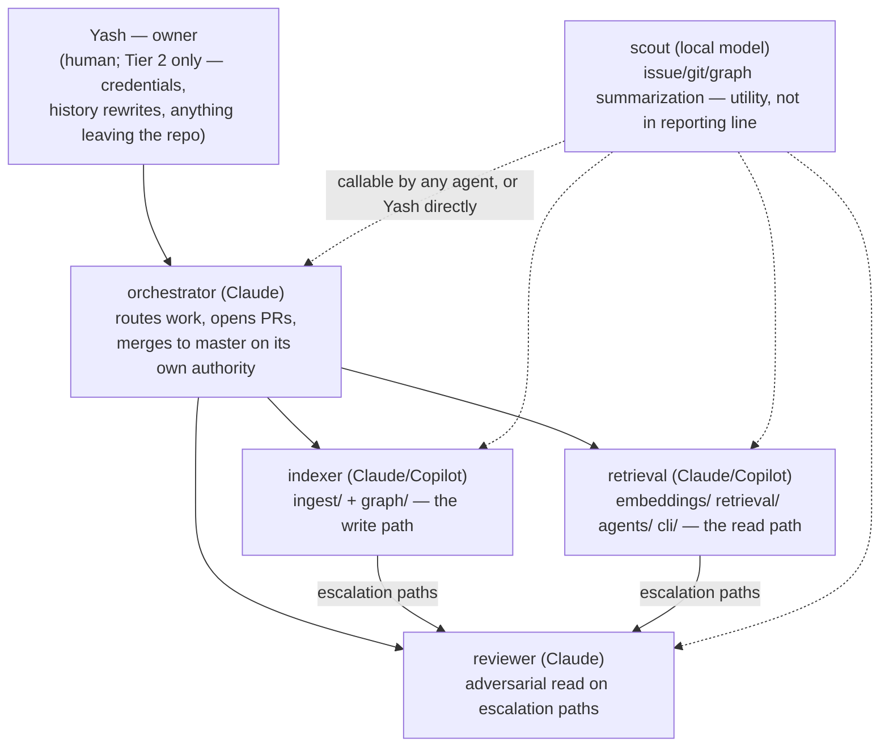

# Agent org chart

**Five roles**, split by the surfaces this repo actually has: a write path
that builds the graph, a read path that queries it, a reviewer for the
changes that fail silently, a router, and a free local summarizer.

## Why five and not seven

This roster is adapted from the one in
[`ingredion-agent-config`](https://github.com/yashmhatre/ingredion-agent-config),
but it is not a copy. That project has seven roles because it has a
production Delta pipeline, deployed Databricks notebooks with two known live
defects, bundle configs that decide which identity production runs as, and a
`dev`/`staging`/`main` promotion chain. Every one of those roles maps to a
surface that can break something outside the repo.

This repo has none of that. It is a local developer tool with one long-lived
branch and no deployment. Three roles were dropped because the surface they
guard does not exist here:

- **`platform`** — no `databricks.yml`, no bundle targets, no service
  principals, no cloud provisioning of any kind.
- **`architect`** — the design authority for a solo tool with a five-stage
  roadmap in `README.md` is the person reading the roadmap. A role whose only
  output is a design doc handed to one implementer is the ceremony that
  project already cut once.
- **`notebook-qa`** — no notebooks.

Carrying those over would repeat exactly the mistake that project's own org
chart describes fixing: roles that exist to relay work rather than to own a
surface.

## Where authority sits

**The boundary is what a revert can undo.** `orchestrator` merges into
`master` on its own authority — that is not an interruption and does not need
Yash. What stays with him is what reverting cannot fix: credentials, `master`
history rewrites, repository settings, and anything published outside this
repo. See `docs/agent_governance.md` for the tiers.

That is a wider grant than the Ingredion orchestrator has, which merges only
into `dev` with staging and prod still gated. There is no `dev` here. It works
because nothing is deployed from `master` and a bad merge costs a revert —
but note the one thing a revert does not undo: **this repo is public**, so a
merge publishes. A leaked credential stays leaked. That is the asymmetry
Tier 2 exists to protect, not the merge itself.

`orchestrator` is the one funnel below Yash — every other agent is reachable
through it. It has no `Edit` or `Write` tool, deliberately: the agent that
decides a change is ready is not the agent that wrote it.

`reviewer` never merges and never reviews work it produced itself. On this
repo its trigger list is short and evidence-based: destructive Cypher, node
keys and schema, repository scoping, and file-exclusion logic. Those are the
paths where a wrong change **reports success and produces a wrong graph** —
the failure mode that actually bit this repo, twice, on 2026-08-14. Ordinary
code changes do not need it.

Because `orchestrator` merges without a human reading the packet, a `reviewer`
verdict on those paths is now the **last** check rather than the first of two.
That raises what a weak verdict costs, and `reviewer.md` is written against
that.

## The write/read split

`indexer` and `retrieval` divide on the direction data flows, not on
subsystem tidiness:

- `indexer` **writes** the graph — parsing, schema, loading, Cypher that
  mutates. Its failures corrupt data.
- `retrieval` **reads** it — embeddings, vector search, context assembly, the
  CLI. Its failures return a bad answer but leave the graph intact.

Those are different risk profiles and different review needs, which is why
the split is here rather than, say, between `ingest/` and `graph/`. Those two
are one transaction — a parser field is useless until the loader persists it
— so they stay with one agent.

## Two substrates, one set of rules

`indexer` and `retrieval` each exist twice, and this is the whole reason the
roster is affordable:

| Role | Copilot | Claude Code |
| --- | --- | --- |
| `indexer` | `.github/agents/indexer.agent.md` | `.claude/agents/indexer.md` |
| `retrieval` | `.github/agents/retrieval.agent.md` | `.claude/agents/retrieval.md` |

Both halves read `CLAUDE.md`, which VS Code Copilot and Claude Code both load
automatically. The rules do not change with the substrate — only the cost does.
`.github/instructions/*.instructions.md` carries the same rules to plain
Copilot chat via `applyTo` globs, so editing a file under `graph/` picks them
up without selecting an agent at all.

**Copilot is the default for implementation work.** The Claude subagents are
for what it cannot do: a change needing an independent `reviewer` verdict, or
one spanning both paths. Exhausting Copilot's premium allowance is not a
reason to escalate — it falls back to an included model rather than stopping.

The other three roles have no Copilot half, for reasons that are structural
rather than budgetary. `orchestrator` routes to other agents, and a Copilot
agent cannot spawn agents. `reviewer` must be a different process from the
author, and it is now the last check before a public merge. `scout` already
runs free on local Ollama, so moving it would spend premium requests on
exactly the reading it exists to make free.

`orchestrator` also asks Copilot for a PR review before invoking `reviewer`,
so the expensive pass starts from what the free one missed.

## scout — a utility, not a report

`scout` sits outside the hierarchy on purpose. It reports to no one and no
one reports to it: it is a shared, free pre-processing step that any agent,
or Yash directly, calls before spending Claude tokens on raw material. It
runs on a local Ollama model, is read-only, and cannot spawn other agents.

On this repo it has one capability the Ingredion version does not: **read-only
Cypher against the local graph.** Answering "which functions call this one"
from the graph is cheaper and more accurate than reading the source, and this
is the one repo where that index is guaranteed to exist.

Much of `scout`'s issue and CI work is already available without a subagent
at all, through the `context-scout` MCP server from that same config repo —
`context_scout_summarize_issue`, `context_scout_git_context`,
`context_scout_pr_ci_status`. **Prefer the MCP tools when they cover the
question**; they are a direct call with no subagent turn around them. Use the
`scout` agent when the work needs several such lookups stitched together, or
needs a graph query.

**Its output is an index, never evidence.** A small local model produces
fluent, confident, wrong summaries. It tells you where to look. If a decision
rests on a `scout` summary being right, verify it first.
